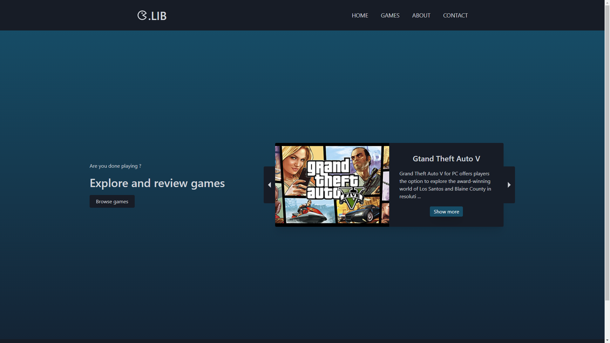

<br/>
<p align="center">
  <a href="https://github.com/Robert Smrek/AWT - Games Library">
    
  </a>

  <h3 align="center">Games Library</h3>
</p>

   

## Table Of Contents

-   [About the Project](#about-the-project)
-   [Built With](#built-with)
-   [Getting Started](#getting-started)
    -   [Prerequisites](#prerequisites)
    -   [Installation](#installation)
-   [Roadmap](#roadmap)
-   [Contributing](#contributing)
-   [License](#license)
-   [Authors](#authors)

## About The Project



This project is for my school assigment to build full website on any theme.

Project is still work in progress

## Built With

Whole app is build with React and Tailwind css with custom API.

## Getting Started

This is an example of how you may give instructions on setting up your project locally.
To get a local copy up and running follow these simple example steps.

### Prerequisites

This is an example of how to list things you need to use the software and how to install them.

-   npm

```sh
npm install npm@latest -g
```

### Installation

1. Clone the repo

```sh
git clone git@github.com:bckslash/GamesLibrary.git
```

3. Install NPM packages

```sh
npm -i
```

4. Run the app in the development mode.

```sh
npm start
```

## Roadmap

See the [open issues](https://github.com/Robert Smrek/AWT - Games Library/issues) for a list of proposed features (and known issues).

## Contributing

Contributions are what make the open source community such an amazing place to be learn, inspire, and create. Any contributions you make are **greatly appreciated**.

-   If you have suggestions for adding or removing projects, feel free to [open an issue](https://github.com/Robert Smrek/AWT - Games Library/issues/new) to discuss it, or directly create a pull request after you edit the _README.md_ file with necessary changes.
-   Please make sure you check your spelling and grammar.
-   Create individual PR for each suggestion.
-   Please also read through the [Code Of Conduct](https://github.com/Robert Smrek/AWT - Games Library/blob/main/CODE_OF_CONDUCT.md) before posting your first idea as well.

### Creating A Pull Request

1. Fork the Project
2. Create your Feature Branch (`git checkout -b feature/AmazingFeature`)
3. Commit your Changes (`git commit -m 'Add some AmazingFeature'`)
4. Push to the Branch (`git push origin feature/AmazingFeature`)
5. Open a Pull Request

## License

Distributed under the MIT License. See [LICENSE](https://github.com/Robert Smrek/AWT - Games Library/blob/main/LICENSE.md) for more information.

## Authors

-   **Robert Smrek** - _TUKE Student_ - [Robert Smrek](https://github.com/bckslash) - \*\*
